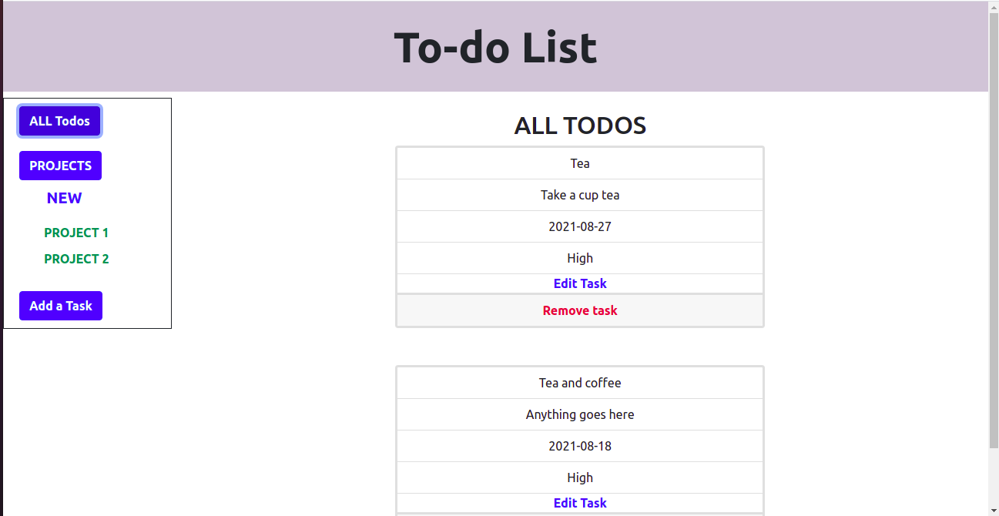

# Todo_list

>This is a task management app built with Javascript and webpack. The user can create projects, Todos and delete todos




## Built With

- Javascript
- CSS
- Webpack

## Live version

You can check the live version in [this link](https://mytaskers.netlify.app/#)

## Getting Started

To get a local copy up and running follow these simple example steps.
On your terminal, run 
```
 git clone git@github.com:Nasa28/Todo_list.git

```


### Usage

- cd into the project

- open the project using code editor of your choice

- Open the `index.html` file with your browser

### Running Test

To run the test suites, you need to follow the steps below:

- run `npm install --save-dev jest` to install `jest` dependency. then
- run `npm test`

## Authors

👨‍💻 **Kalu Chinasa Agu**

- Github: [@Nasa28](https://github.com/Nasa28)
-  Twitter: [@Ultimate_Nasa](https://twitter.com/Ultimate_Nasa)
- LinkedIn: [LinkedIn](https://www.linkedin.com/in/kalu-chinasa-agu-a15080103/)


## 🤝 Contributing

Contributions, issues, and feature requests are welcome!

Feel free to check the [issues page](https://github.com/Nasa28/Todo_list/issues).

## Show your support

Give a ⭐️ if you like this project!

## 📝 License

This project is [MIT](LICENSE) licensed.